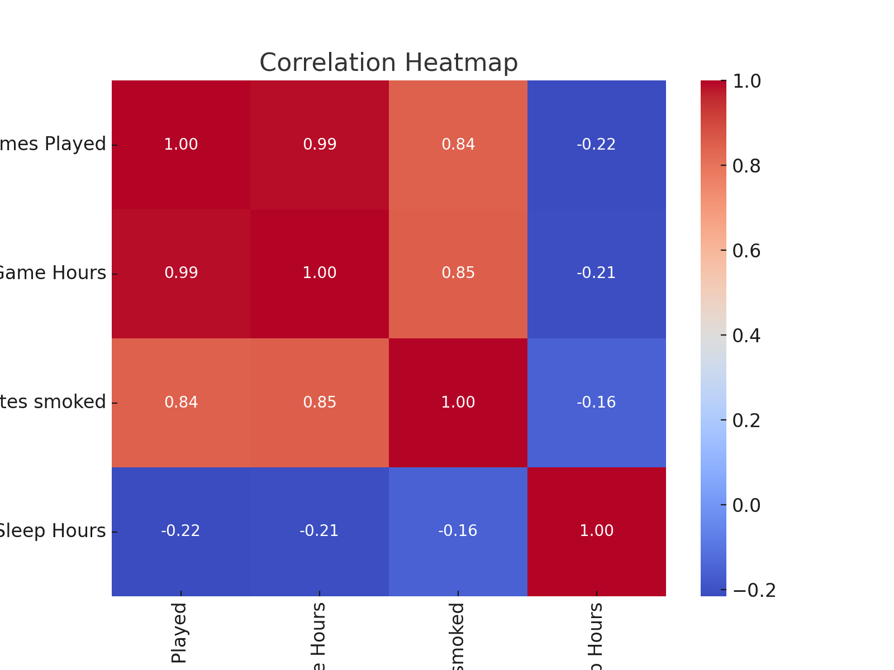
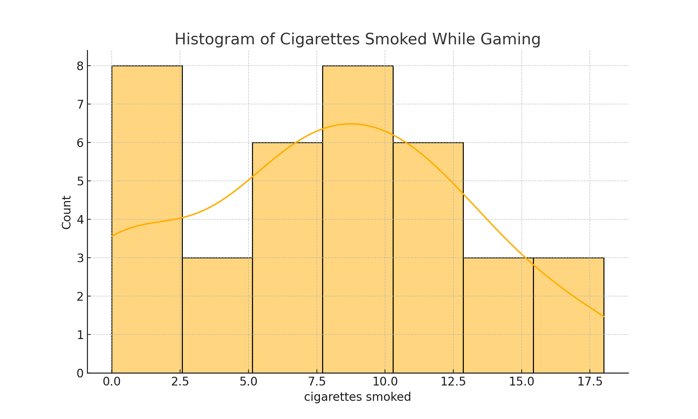
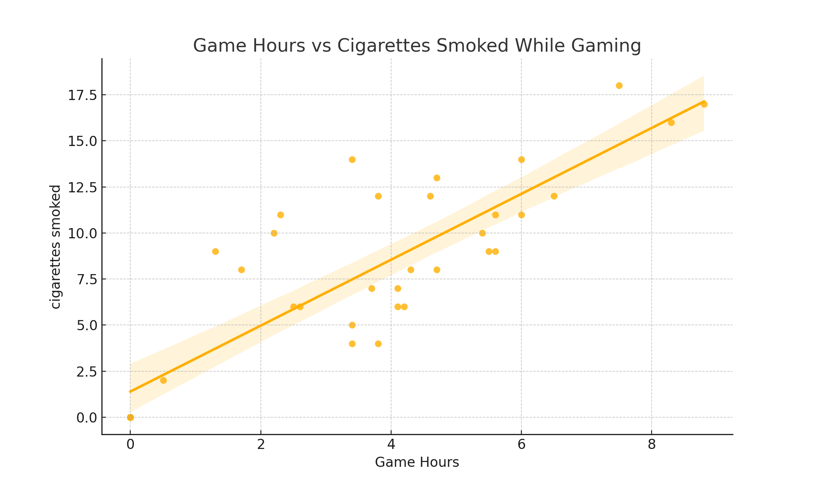
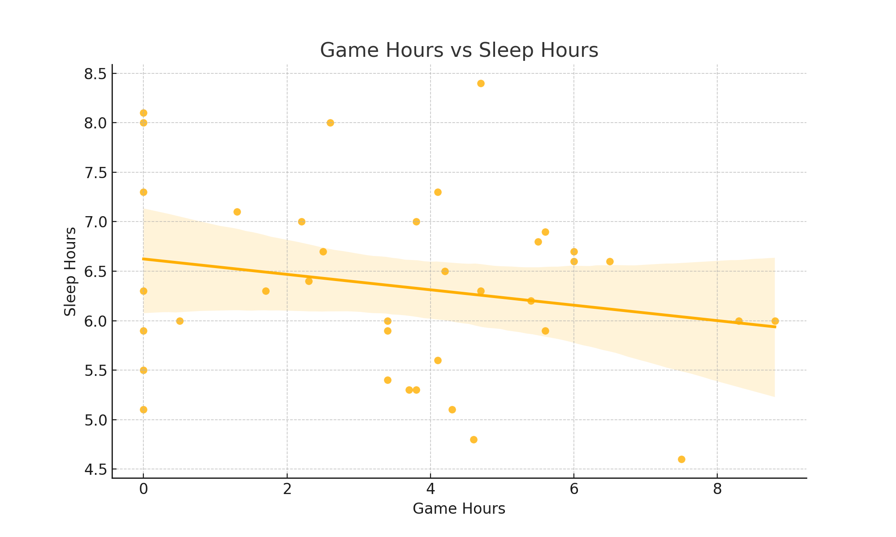

# The Effects of Gaming on Sleep Duration and Cigarette Consumption

## Motivation

This project explores how daily gaming habits affect personal behaviors such as sleep duration and cigarette consumption. The motivation stems from a curiosity about how intense gaming sessions influence health-related routines. By collecting data from personal records over 47 days, the project analyzes whether there is a consistent pattern between increased game time and the amount of sleep or cigarettes consumed.

The analysis focuses on answering two research questions:
1. Does playing more games reduce the amount of sleep I get?
2. Does playing more games increase the number of cigarettes I smoke while gaming?

Understanding these relationships can be useful for anyone trying to identify hidden patterns in their habits and evaluate the potential impact of recreational activities on health.

---

## Dataset

The dataset spans from **March 10 to April 26** and includes the following daily variables:

- **Date**: Calendar date of entry
- **Games Played**: Number of games played per day
- **Game Hours**: Total time spent gaming in hours
- **Cigarettes Smoked**: Number of cigarettes smoked during gaming
- **Sleep Hours**: Hours of sleep recorded per night

### Data Sources
- **Game data** was retrieved using Riot Games' official match history tools.
- **Sleep data** was collected using an Apple Watch.
- **Cigarette consumption** was recorded manually after each gaming session.

---

## Exploratory Data Analysis (EDA)

### Outlier Detection
Using the **IQR (Interquartile Range)** method, we tested for outliers in both `Cigarettes Smoked` and `Sleep Hours`.  
The result: **No outliers were found** in either column.

### Correlation Heatmap
We examined relationships between all variables using Pearson correlation:

- `Game Hours` and `Games Played` are strongly positively correlated with `Cigarettes Smoked`
- `Game Hours` and `Sleep Hours` show a weak negative correlation

---

## Histogram of Cigarettes Smoked

This distribution shows that most values fall between 6 and 10 cigarettes per session:

---

## Scatter Plots

### Game Hours vs Cigarettes Smoked  
A strong positive relationship is clearly visible:

### Game Hours vs Sleep Hours  
Sleep time slightly decreases as game hours increase:

---

## Hypotheses & Results

### Hypothesis 1: *Does playing games reduce sleep duration?*

> **Result:**  
The correlation analysis shows a weak negative correlation (r = -0.21) between Game Hours and Sleep Hours.  
The p-value (0.2181) is not statistically significant.  
**Conclusion:** This suggests that although sleep duration may slightly decrease with more game time, the effect is not strong or consistent enough to draw definitive conclusions.

---

### Hypothesis 2: *Does playing more games increase the number of cigarettes smoked while gaming?*

> **Result:**  
This relationship shows a very strong and statistically significant positive correlation (r = 0.85, p < 0.0000000001).  
**Conclusion:** The data supports the hypothesis that longer gaming sessions are associated with smoking more cigarettes. This insight may be helpful for identifying gaming-related behavioral triggers.

---

## Modeling 

Various regression models were tested to predict Cigarettes Smoked and Sleep Hours.  
The best performing models were:
- **Random Forest** for predicting Games Played
- **Decision Tree** for predicting Cigarettes Smoked

These models confirmed the strength of the Game Hours variable in estimating cigarette consumption.

---

## Conclusion

This study successfully links self-recorded gaming behaviors with key lifestyle variables.  
- Strong evidence was found for gaming affecting smoking frequency.  
- Sleep duration, however, did not show a strong or statistically significant connection.  
By understanding these links, one can reflect on the broader consequences of everyday habits.

